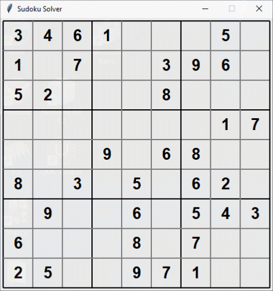

# Sudoku Solver

This sudoku solver is written using a simple backtracking algorithm. I wrote it for fun over a few hours on a weekend.  
  
The ```cli_solver``` folder contains a simple solver which outputs the completed sudoku puzzle to the console.
  
The ```gui_solver``` folder contains the same code except it is visualised with a GUI, using the Python module tkinter. To change the visualisation speed, change the value of the SPEED variable found at the top of **solver.py**.

Below is an example of a sudoku being solved with visualisation. This example uses a SLEEP value of 100 milliseconds.

---
<br></br>
<p align="center">
  
</p>
  
